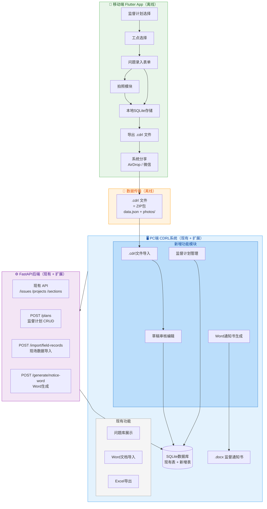
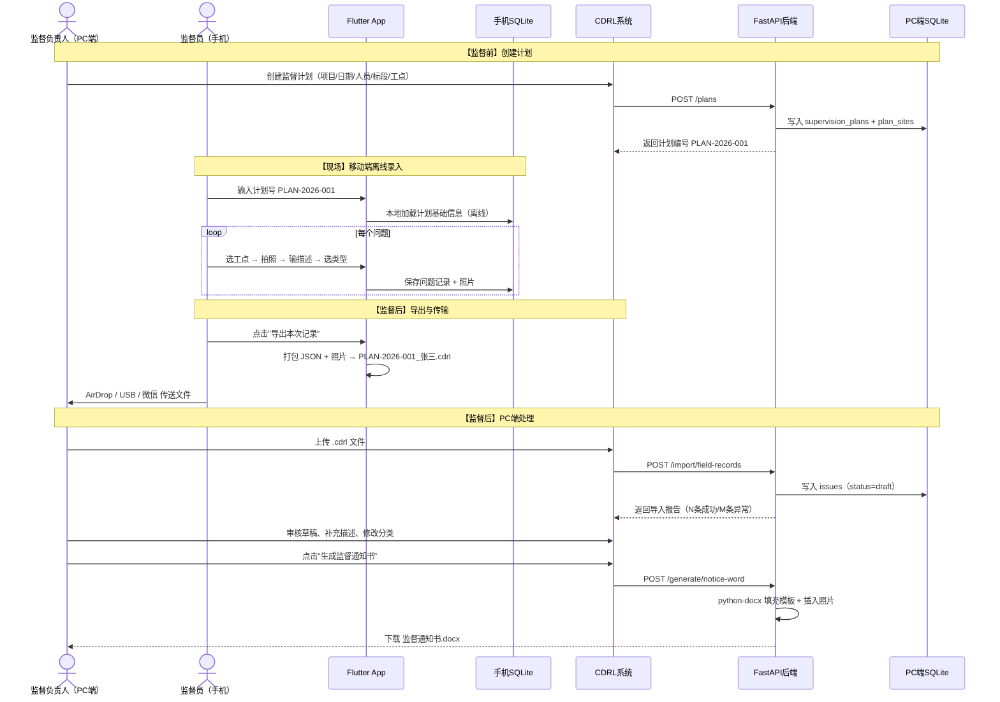

# 铁路工程监督问题录入与管理系统 — 完整技术方案

> 文档版本：v1.0 | 日期：2026-03-22

---

## 一、系统架构总览

### 1.1 整体架构



### 1.2 数据流转时序



---

## 二、移动端技术选型

### 2.1 框架推荐：Flutter

| 对比维度 | Flutter | React Native |
|---------|---------|-------------|
| 跨平台 | iOS + Android ✅ | iOS + Android ✅ |
| 本地SQLite | `sqflite`（成熟稳定）✅ | `react-native-sqlite-storage` |
| 文件系统/分享 | `path_provider` + `share_plus` ✅ | `react-native-fs` |
| 相机调用 | `image_picker` ✅ | `react-native-image-picker` |
| ZIP打包 | `archive` 库 ✅ | `react-native-zip-archive` |

**选 Flutter 的核心理由：**
- iOS 上 AirDrop/Files.app 集成更顺畅，`share_plus` 直接触发系统分享菜单
- `sqflite` 与 PC 端 SQLite 数据结构完全对齐，便于调试
- 离线表单类 App 是 Flutter 的强项

### 2.2 核心功能模块

#### 监督计划选择
- 支持手动输入计划编号（如 `PLAN-2026-001`）或列表选择
- 首次加载时通过 `GET /plans/{id}` 获取并缓存到本地 SQLite
- 后续完全离线，无需再联网

#### 问题录入表单
```
工点（下拉，来自计划预设）  ← 核心字段，无需重复输入
问题描述（多行文本）
问题类型（质量 / 安全 / 管理行为）
严重程度（一般 / 较重 / 严重）
照片（1-5张，调用系统相机）
备注（可选）
```

#### "照片先行"模式（专为老同志设计）
- 单独入口：**直接拍照**，生成一条 `status: "photo_only"` 的空白记录
- 照片 + 工点必填，其他字段可为空
- PC 端导入后在草稿列表中高亮提示补充文字

---

## 三、数据交换格式：`.cdrl` 文件

`.cdrl` 本质是一个 **ZIP 压缩包**：

```
PLAN-2026-001_张三.cdrl
├── manifest.json        ← 元信息
├── records.json         ← 问题记录数组
└── photos/
    ├── uuid-001.jpg
    └── uuid-002.jpg
```

### manifest.json
```json
{
  "export_version": "1.0",
  "plan_id": "PLAN-2026-001",
  "inspector": "张三",
  "export_time": "2026-03-12T18:30:00",
  "device_id": "iphone-xxx"
}
```

### records.json（与现有 issues 表兼容）
```json
{
  "records": [
    {
      "temp_id": "550e8400-e29b-41d4-a716-446655440000",
      "project_name": "南玉铁路项目",
      "section_name": "CNYZ-1标",
      "site_name": "K23+500路基",
      "description": "路基填土压实度不足，检测值88%",
      "issue_category": "质量问题",
      "issue_type_level1": "路基工程",
      "severity": "较重",
      "inspection_date": "2026-03-12",
      "status": "draft",
      "photos": ["uuid-001.jpg", "uuid-002.jpg"]
    }
  ]
}
```

---

## 四、PC端新增功能模块

在现有 CDRL 系统（FastAPI + Vue3）基础上新增 4 个模块：

### 4.1 监督计划管理
- 创建计划：填写项目名称、检查日期、参与人员、标段/工点预设
- 自动生成计划编号（如 `PLAN-20260312-001`）
- 可将计划导出为 JSON 文件，发给现场人员（完全离线场景）

### 4.2 现场记录导入（`.cdrl` 文件）
- 前端：文件上传控件（接受 `.cdrl` 文件）
- 后端新增接口：`POST /import/field-records`
- 处理流程：
  1. 解压 ZIP → 读取 `manifest.json` + `records.json`
  2. 校验必填字段、枚举值、日期格式
  3. 图片存储到 `issue_images` 表
  4. 写入 `issues` 表，`status = 'draft'`
  5. 返回导入报告：`{total: N, success: M, errors: [{temp_id, reason}]}`

### 4.3 草稿审核编辑界面
- 在现有 `IssuesTable.vue` 基础上增加"草稿"筛选视图
- `photo_only` 状态的记录显示橙色警告图标，提示补充文字
- 支持在线编辑：补充文字描述、调整分类、关联现有标段
- 批量确认：一键将本次计划所有草稿变为正式记录（`status = 'confirmed'`）

### 4.4 Word 通知书生成
详见第六节。

---

## 五、数据库扩展方案

只需在现有库基础上**新增 2 张表 + 修改 1 个字段**：

```sql
-- 新增：监督计划表
CREATE TABLE supervision_plans (
    id INTEGER PRIMARY KEY AUTOINCREMENT,
    plan_number TEXT NOT NULL UNIQUE,       -- PLAN-2026-001
    project_name TEXT,
    inspection_date TEXT,
    inspectors TEXT,                        -- JSON数组，人员名单
    status TEXT DEFAULT 'active',
    created_at TEXT DEFAULT CURRENT_TIMESTAMP
);

-- 新增：计划预设工点表
CREATE TABLE plan_sites (
    id INTEGER PRIMARY KEY AUTOINCREMENT,
    plan_id INTEGER REFERENCES supervision_plans(id),
    section_name TEXT,
    site_name TEXT
);

-- 修改 issues 表：新增状态字段
ALTER TABLE issues ADD COLUMN status TEXT DEFAULT 'confirmed';
-- draft       = 移动端导入的草稿，待审核
-- confirmed   = 已审核的正式记录
-- photo_only  = 仅有照片，未补充文字描述
```

---

## 六、Word 通知书自动生成方案

### 6.1 技术选型：`python-docx`

现有 `word_parser.py` 已使用 `python-docx` 解析 Word 文档，生成方向是其天然扩展，**无需引入新依赖**。

### 6.2 模板策略

采用**模板替换**而非从零生成：

1. 准备标准监督通知书 Word 模板：`backend/templates/notice_template.docx`
2. 在模板中用占位符标记填充位置：

| 占位符 | 填充内容 |
|--------|---------|
| `{{项目名称}}` | 项目全称 |
| `{{检查日期}}` | 如 2026年3月12日 |
| `{{质量问题数量}}` | 自动统计 |
| `{{安全问题数量}}` | 自动统计 |
| `{{管理行为问题数量}}` | 自动统计 |
| `{{问题列表}}` | 按标段-工点分组的问题正文 |

### 6.3 问题列表与照片插入（核心逻辑）

```python
# 按 section_name → site_name 分组
for section_name, sites in grouped_issues.items():
    doc.add_paragraph(f"一、{section_name}", style='Heading 2')
    for site_name, issues in sites.items():
        doc.add_paragraph(f"（一）{site_name}", style='Heading 3')
        for i, issue in enumerate(issues, 1):
            doc.add_paragraph(f"{i}. {issue['description']}")
            for photo_path in issue['photos']:
                doc.add_picture(photo_path, width=Inches(5.5))
                doc.add_paragraph()  # 照片后空行
```

### 6.4 问题统计自动填充

```python
stats = {
    "质量问题": len([i for i in issues if i['issue_category'] == '质量问题']),
    "安全问题": len([i for i in issues if i['issue_category'] == '安全问题']),
    "管理行为问题": len([i for i in issues if i['issue_category'] == '管理行为问题']),
}
# 遍历段落，替换占位符
for para in doc.paragraphs:
    for key, val in stats.items():
        if f'{{{{{key}数量}}}}' in para.text:
            para.text = para.text.replace(f'{{{{{key}数量}}}}', str(val))
```

### 6.5 新增后端接口

```python
@app.post("/generate/notice-word")
async def generate_notice_word(
    plan_id: str,
    include_photos: bool = True
):
    # 1. 从数据库查询 confirmed 状态的问题
    # 2. 按 section_name → site_name 分组
    # 3. 调用 word_generator_service.generate()
    # 4. 返回 .docx 文件流（FileResponse）
```

---

## 七、实施计划与工作量评估

| 阶段 | 内容 | 工作量 | 优先级 |
|------|------|--------|--------|
| **阶段一** | 数据库扩展（新增表 + issues.status 字段）+ `/plans` CRUD API | 2天 | 🔴 最高 |
| **阶段二** | 后端 `POST /import/field-records` 接口（解析.cdrl、写入草稿） | 2天 | 🔴 最高 |
| **阶段三** | 前端：监督计划管理页面 + 草稿审核编辑界面 | 3天 | 🟡 高 |
| **阶段四** | 后端 `POST /generate/notice-word`（Word生成服务） | 3天 | 🟡 高 |
| **阶段五** | 移动端 Flutter App MVP（计划选择 + 录入 + 导出） | 2-3周 | 🟢 中 |
| **阶段六** | 移动端：照片先行模式 + UI打磨 + 真机测试 | 1周 | 🟢 中 |

**总计**：PC端改动约 **10个工作日**，移动端约 **3-4周**

### 风险点与应对措施

| 风险 | 应对措施 |
|------|---------|
| Word模板格式复杂，`python-docx` 难以完美复现 | 先实现80%格式，预留人工微调空间；提供"生成后人工检查"流程 |
| 照片体积大，.cdrl文件过大 | 导出时对照片压缩到1080p / 500KB以内 |
| Flutter App开发周期长，现场等不及 | 阶段一二完成后，可用手填JSON或Excel模板过渡 |
| 老同志不会用App | 保留现有Word导入流程不受影响，新系统是增量扩展 |

---

## 八、需要修改的现有代码清单

| 文件 | 改动内容 |
|------|---------|
| `database_schema.sql` | 新增 `supervision_plans`、`plan_sites` 表；`issues` 表加 `status` 字段 |
| `backend/app/main.py` | 新增 `/plans`、`/import/field-records`、`/generate/notice-word` 路由 |
| `backend/app/services/field_import_service.py` | 新建：解析 .cdrl 文件，写入草稿 |
| `backend/app/services/word_generator_service.py` | 新建：python-docx 生成通知书 |
| `backend/templates/notice_template.docx` | 新建：标准通知书 Word 模板 |
| `frontend/src/views/PlanManagement.vue` | 新建：监督计划管理页面 |
| `frontend/src/views/DraftReview.vue` | 新建：草稿审核编辑页面 |
| `frontend/src/router/index.js` | 新增路由配置 |
| `frontend/src/components/IssuesTable.vue` | 新增草稿状态筛选和标注显示 |

---

## 九、建议实施顺序

```
阶段一（数据库+计划API）
    ↓
阶段二（.cdrl导入接口）← 此时可用手动构造JSON文件测试整个流程
    ↓
阶段三（前端审核界面）
    ↓
阶段四（Word生成）← PC端完整闭环，可投入使用
    ↓
阶段五/六（移动端App）← 替代手工JSON，提升现场体验
```

> **最小可行路径**：完成阶段一至四后，即使没有 App，也可以通过"手动填写 JSON 文件 → 上传导入"的方式跑通完整流程，验证系统可用性后再投入移动端开发。

